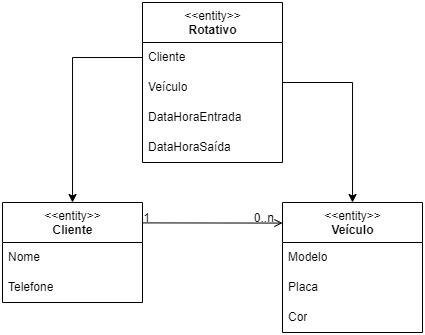

# Estacionamento Rotativo Web
Sistema para manipular e listar o fluxo de vagas rotativas de um estacionamento.

## Funcionalidades
* CRUD cliente e veículo
* Registrar entrada de veículo
* Registrar saída de veículo
* Filtrar veículos estacionados

## Entidades:
* Cliente: 
    - Nome
    - Telefone
* Veículo:
    - Modelo
    - Placa
    - Cor
* Rotativo
    - Identificação do veículo
    - Momento de entrada (dia e hora)
    - Momento de saída (dia e hora)

## Diagrama

